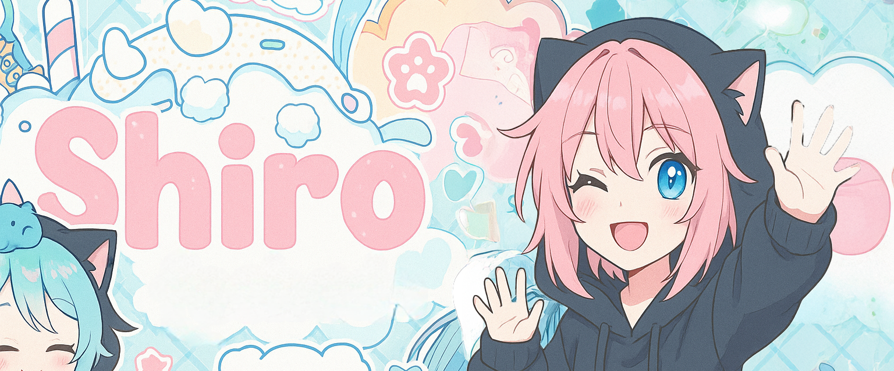

<div align="center">
  <!-- Animated heading -->
  
</div>

---

## A B O U T  M E


```lua
local Shirro = {
  alias        = "Vixiie",
  pronouns     = "he/him",
  contact      = {
    discord  = "vixiiemilk",
    matrix   = "@shiro:matrix.subversion.life",
    telegram = "@Dynamic155"
  },
  coding       = {
    languages = { "Lua", "Python", "Batch", "Bash" },
    tools     = { "git", "neovim", "docker" },
    os        = { "Arch", "Debian", "Ubuntu", "Windows" }
  },
  fandoms      = {
    anime  = { "No Game No Life", "Nekopara", "Charlotte", Himegoto },
    manga  = { "Chainsawman", "Tokyo Ghoul" }
  },
  playlists    = {
    "I'll Sleep When I'm Dead – NightcoreMaker",
    "The Zombie Song (Nightcore) – Erenzy, vnti",
    "strangers once again - Tanger",
    "NASTYWERKKKK! – femtanyl"
  },
  games        = { "Valorant", "Counter‑Strike 2", "BeamNG.Drive", "DayZ" }
}
```

<br clear="left"/>

---

## G I T H U B  S T A T S

<table>
  <tr>
    <td>
      
    </td>
    <td>
      
    </td>
    <td>
      
    </td>
  </tr>
</table>

---

##  T E C H  S T A C K &  T O O L S

<p align="center">
  
  
  
  
  
  
  
  
</p>

---

##  B E F O R E  Y O U  G O

<div align="center">
  

  <p><em>If you like my profile, please ⭐ this repo before you fork it ✨</em></p>
</div>
