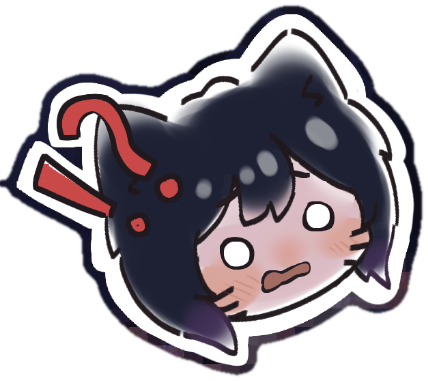
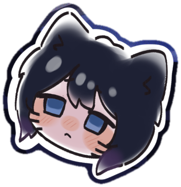
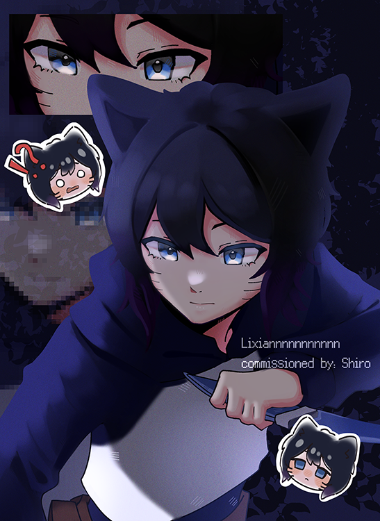

<!--
  Cute GitHub profile template for Shirozy

  Quick edit guide:
  - Replace the text inside the ABOUT_ME Lua table with your newest info.
  - Swap image paths if you rename files in /oc.
  - Change Shirozy in the stats URLs if your GitHub username changes.
  - Badge colors currently match the new OC banner: deep blue, white, and soft pink.
-->

<div align="center">
  

  <br />

  

  <p>
    <a href="https://github.com/Shirozy">
      
    </a>
    
    
  </p>
</div>

---

## About Me


<!-- Edit this block whenever your info changes. Keep it playful, or rewrite it completely. -->

```lua
local ABOUT_ME = {
  name = "Vixiie",
  username = "Shirozy",
  pronouns = "he/him",

  vibe = {
    "anime-coded",
    "breakcore-powered",
    "uwu mrow :3"
  },

  currently = {
    learning = { "Lua", "Python", "Linux" },
    building = { "MagnesiumX", "Roblox UI", "tiny tools" },
    exploring = { "self-hosting", "rice setups", "game servers" }
  },

  contact = {
    discord = "vixiiemilk",
    matrix = "@dynamic155:matrix.subversion.life",
    telegram = "@Dynamic155"
  },

  favorites = {
    anime = { "No Game No Life", "Nekopara", "Charlotte", "Himegoto" },
    manga = { "Chainsaw Man", "Tokyo Ghoul", "No Game No Life" },
    games = { "Valorant", "Counter-Strike 2", "Neverness To Everness", "Satisfactory" },
    music = {
      "poster boy - 2hollis",
      "Умри, если меня не любишь - DAKOOKA",
      "strangers once again - Tanger",
      "NASTYWERKKKK! - femtanyl"
    }
  }
}
```

<br clear="right" />

---

<!-- ## Tech Stack

<div align="center">
  
  <br />
  
  
  
  
  
  
  
  
  <br />
  
</div>

--- -->

## GitHub Stats

<div align="center">
  
  
  <br />
  
</div>

---

## Current Mood Board

<!-- Replace these with projects, screenshots, or OC lore snippets when you are ready. -->

<table>
  <tr>
    <td width="33%" align="center">
      <strong>Now</strong><br />
      meowing at the haters
    </td>
    <td width="33%" align="center">
      <strong>Next</strong><br />
      animeeee uwu
    </td>
    <td width="33%" align="center">
      <strong>Always</strong><br />
      late nights and coffee
    </td>
  </tr>
</table>

---

<div align="center">
  

  <p><em>Thanks for visiting. Star this before you go?</em></p>
</div>
